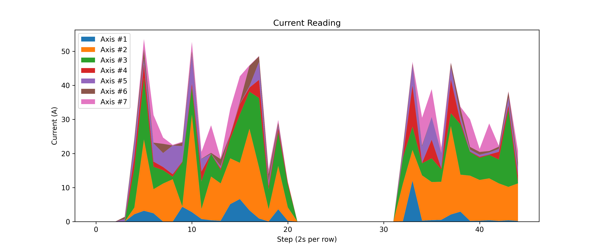

# 🏡 Data Streaming and Visualization Workshop
- Streaming Data for Predictive Maintenance with Linear Regression-Based Alerts

##  📘 Use case: Manufacturing Robot predictive Maintenance ---

## Project overview
This notebook includes: 
- data loading and cleaning with pandas; numeric work with NumPy; plots with matplotlib; training a linear regression model (scikit-learn)
- data live streaming, generation of synthetic datasets, addition of anomaly to the sythetic dataset, visualization of Alerts and Errors based on MinC and MaxC chosen.

### 🚀 Project Summary
This project demonstrates a Manufacturing Robot Predictive Maintenance use case. The notebook walks through data collection, cleaning, visualization, and predictive modeling. Linear Regression is used to understand patterns in robot sensor data, and alert rules are applied to anticipate potential failures before they occur.

Key features:
- Data loading and cleaning with pandas
- Numerical computations with NumPy
- Visualizations with matplotlib
- Linear Regression modeling with scikit-learn
- Predictive alerts for maintenance decisions


## 🛠️ Requirements
- Python 3.8+ (recommended)
- Python packages (install via pip):
  - IPython
  - matplotlib
  - numpy
  - os
  - pandas
  - plot_dashboard
  - psycopg2
  - scipy
  - sklearn
  - sqlalchemy
  - time


## 📂 Repository Contents

- **`PracticalLab1.ipynb`**  
  The main notebook containing all explanations, exercises, and challenges.  
- **`data/`**  
  The datasets (e.g., `synthetic_dataset.csv`) used in the code.  
- **`images/`**  
  Illustrations and screenshots used to support the explanations.   

---


## Creating your environment
---
- Start by creating a Virtual Environment for your project

Before running any code in this notebook, it's important to set up a clean Python environment to manage dependencies. We recommend using a **VENV-type virtual environment** in **Visual Studio Code (VSC)**. Follow these steps:

### ✅ Steps to Create a Virtual Environment in VSC

1. **Open your project folder** in Visual Studio Code.
2. **Create the virtual environment** by running:
   ```bash
   python -m venv .venv
   ```
3. Once the environment is created, **activate it**.
    On Windows:
    ```bash
    .\venv\Scripts\activate
    ```

## How to run your workshop
1. Make sure Python and the required packages are installed.
2. Open the notebook `PracticalLab1.ipynb` in Jupyter Notebook or JupyterLab.
3. Run the cells in order (Kernel → Restart & Run All) to reproduce the steps and outputs.
4. You can also run parts of the notebook one cell at a time while following the comments.


## Step-by-step
1. Create staging table in Neon (if not already created)
2. Load CSV into pandas
3. Rename columns to match staging table
4. Keep only the required columns
5. Convert time to proper datetime
6. Insert into staging table
7. Min-Max normalization (if needed)

## Data Streming for the Original Data


## Regression and Alert Rules
`Generation of the Synthetic Data`

- 📊 Data Comparison Table

| Axis   |   orig_mean |   synth_mean |   orig_std |   synth_std |
|:-------|------------:|-------------:|-----------:|------------:|
| axis1  |    0.725743 |     0.749652 |   2.16212  |    2.1634   |
| axis2  |    3.61337  |     3.63082  |   6.87996  |    6.83079  |
| axis3  |    2.71034  |     2.71424  |   5.1119   |    5.11477  |
| axis4  |    0.620222 |     0.633391 |   1.5749   |    1.56463  |
| axis5  |    0.954521 |     0.959474 |   2.10019  |    2.09259  |
| axis6  |    0.599427 |     0.619406 |   1.8155   |    1.8136   |
| axis7  |    0.870145 |     0.893502 |   2.16681  |    2.17761  |
| axis8  |    0.102214 |     0.105805 |   0.423075 |    0.422077 |


`Normal Distribution curves for all axes`


- Linear Regression models are trained on axis data vs. time to predict future sensor values.
[!Linear_RegressionPLot1](./images/regression_plots_axis1.png)


- Alert rules:
  - If the predicted trend deviates significantly from actual values, raise an alert.
  - Thresholds can be adjusted based on tolerance levels in production.

- 🔍  Why the Choice of MinC and MaxC

We use the regression error’s standard deviation as a baseline. Alerts are set at 2 times this value, meaning unusual but possible changes, while Errors are 4 times bigger, showing very rare and serious issues. The median time step makes anomalies last realistically, not just as single spikes.


✅ So, the design choice here is statistical + practical:

* `2σ` → realistic but detectable Alerts.
* `4σ` → extreme, rare, unmistakable Errors.
* `median_dt` → ensures anomaly blocks respect the dataset’s time granularity.

## Screenshots and Plots of Results
-`Prediction vs. Time Graphs: To show how models forecast future values.`
- During streaming simulation (Step 11), actual sensor values are plotted alongside regression forecasts.

Alert periods are highlighted with colored spans:

  - Orange = Alert

  - Red = Error

This creates a dashboard-style visualization of how the model tracks data in real-time and where anomalies occur.